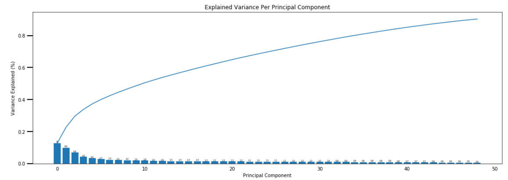
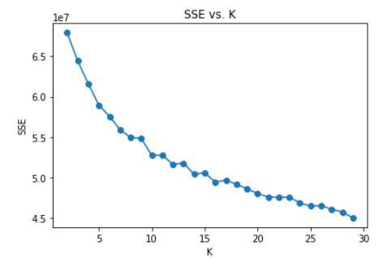
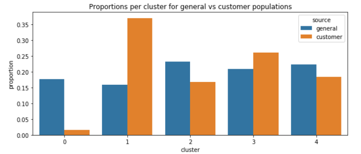

# Identify Customer Segments
Data Scientist Nanodegree Project 3

## Project Description
In this project, I'll apply unsupervised learning techniques to two datasets, identify segments and clusters in population, and see how customer of a mail-order sales company in Germany maps to them. Our main objective is to identify segments of the population that form the core customer base for the company. These segments can then be used to direct marketing campaigns towards audiences that will have the highest expected rate of returns. The data that I'll use has been provided by Bertelsmann Arvato Analytics, and represents a real-life data science task.

## Cluster Analysis Steps

### Data
1. General Demographics Data
1. Customer Demographics Data
Both these datasets went through some data wrangling and standardiztion process before they moved to feature selection/extraction step.

### Feature Selection/Extraction
We have reduced the dimension of features from 94 to 49 by using PCA. 90% of the variace is conserved in this dimensionality reduction step.

### Clustering Algorithm Selection and Validation
We have performed k-means clustering on the PCA-transformed data and then computed the average difference from each point to its assigned cluster's center. The distance decreased rapidly till k=5 and then decayed slowly with increasing k. So, we have selected 5 as the final number of clusters to use, re-fit a KMeans instance to perform the clustering operation.

### Results interpretation
1. PCA Results Interpretation
	* Principal Component 1
	    * High Positives
	        * PLZ8_ANTG3 (Number of 6-10 family houses in the PLZ8 region, high share)               
	        * LP_STATUS_GROB_1.0 (Social status, rough scale, low income earner)       
	        * PLZ8_ANTG4 (Number of 10+ family houses in the PLZ8 region, high share)           
	        * CAMEO_INTL_2015_WEALTH (Wealth Typology, poorer household)
	        * ORTSGR_KLS9 (Size of community, more inhibitants)
	        * EWDICHTE (Density of households per square kilometer, high density)
	        * HH_EINKOMMEN_SCORE (Estimated household net income, very low)
	        * FINANZ_HAUSBAUER (Home ownership, very low)
	    * High Negatives
	        * MOBI_REGIO (Movement patterns, Very high movement)      
	        * FINANZ_MINIMALIST (low financial interest, very high)   
	        * KBA05_ANTG1 (Number of 1-2 family houses in the microcell, lower share)       
	        * PLZ8_ANTG1 (Number of 1-2 family houses in the PLZ8 region, lower share)       
	        * KBA05_GBZ (Number of buildings in the microcell, less buildings)
	        * KONSUMNAEHE (Distance from building to point of sale, close)

	This component seems to describe people, who are relatively poor, living in high density buildings/neighborhoods/community , moving a lot. They are not likely to be interested in saving. They don't own a house.

	* Principal Component 2
	    * High Positives
	        * ALTERSKATEGORIE_GROB (Estimated age based on given name analysis, older)    
	        * FINANZ_VORSORGER (be prepared, low)       
	        * SEMIO_ERL (personality event oriented, lowest)               
	        * ZABEOTYP_3.0 (Energy consumption typology, fair supplied)           
	        * SEMIO_LUST (Personality sensual-minded, lowest)             
	        * RETOURTYP_BK_S (Return type, determined)
	    * High Negatives
	        * PRAEGENDE_JUGENDJAHRE_GENERATION (generation, old)  
	        * FINANZ_SPARER (money-saver, very high)                   
	        * SEMIO_TRADV (Personality traditional, high)                        
	        * SEMIO_REL (Personality religious, high)                     
	        * SEMIO_PFLICHT (Personality dutiful, high)  
	        
	These are older people, more likely to be in their 60s/born in 1940s. They consider themselves to be traditional, religious and dutiful. They have a range of interests in money from money savers. They don't seem likely to make rash purchases.

	* Principal Component 3
	    * High Positives
	        * SEMIO_VERT (Personality dreamful, lowest)    
	        * SEMIO_SOZ  (Personality social-minded, lowest)   
	        * SEMIO_KULT (Personality cultural-minded, lowest)
	        * SEMIO_FAM  (Personality family-minded, lowest)   
	    * High Negatives
	        * SEMIO_KAEM (Personality combative-minded, highest)       
	        * ANREDE_KZ  (Gender, Male)   
	        * SEMIO_DOM  (Personality dominant-minded, highest)       
	        * SEMIO_KRIT (Personality critical-minded, highest)      
	        * FINANZ_ANLEGER (Investor financial typology, high)
	        * SEMIO_RAT (Personality rational, highest)      
	        * SHOPPER_TYP_2.0 (Shopper typology family-shopper, lowest)
	        
	These are men with combative, dominant, critical-minded, rational personality with practical thinking, anti-social, anti0cultural and anti-family attitude. They are interested in money, particularly around investing.

1. Clustering Results Interpretation:

After comparing customer data to general demographics data, we have found that Clusters 1 and 3 are over-represented and clusters 0, 2 and 4 are under-represented in the customer dataset.
Cluster 1 accounts 37% in the customer population and 15.8% in the general population. From our analysis, it is clear that this segment of population are mostly older people, more likely to be in their 60s/born in 1940s.They consider themselves to be traditional, religious and dutiful. They have a range of interests in money from money savers. They don't seem likely to make rash purchases. 
Cluster 0 accounts 1.5% in the customer population and 17.7% in the general population. From our analysis, it is clear that this segment of population are relatively poor, living in high density buildings/neighborhoods/community , moving a lot. They are not likely to be interested in saving. They don't own a house.  

### Knowledge
* The mail-order company is popular with traditionally minded older customers. So we should target this segment of population in the marketing campaigns of the company.
* The mail-order company is relatively unpopular with city living financially unsound customers. So, we need to find ways to attract this segment of population.

