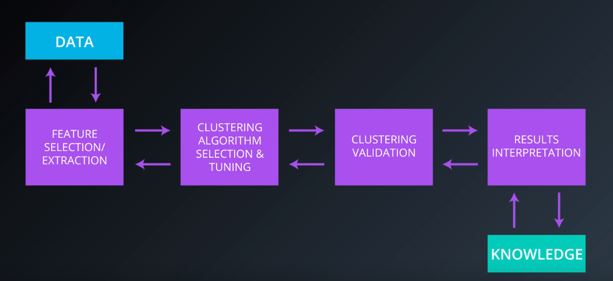

# Identify Customer Segments
Data Scientist Nanodegree Project 3

## Project Description
In this project, I'll apply unsupervised learning techniques to two datasets, identify segments and clusters in population, and see how customer of a mail-order sales company in Germany maps to them. Our main objective is to identify segments of the population that form the core customer base for the company. These segments can then be used to direct marketing campaigns towards audiences that will have the highest expected rate of returns. The data that I'll use has been provided by Bertelsmann Arvato Analytics, and represents a real-life data science task.

## Cluster Analysis

